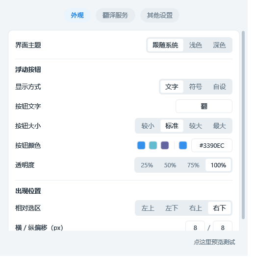
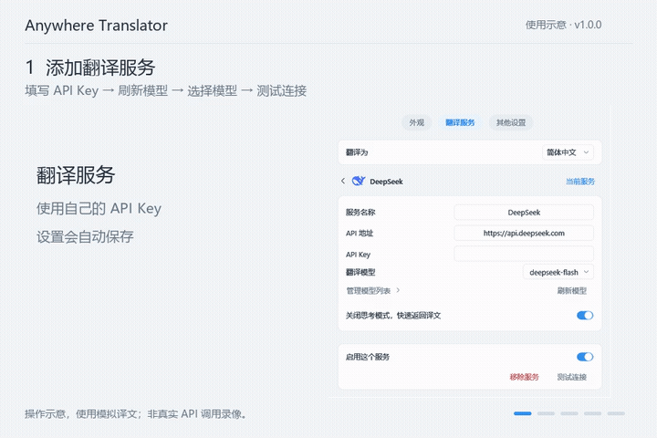

<h1> Anywhere Translator</h1>

Windows 全局划词翻译：选中文字 → 点击按钮 → 查看译文，无需浏览器插件。

[下载 v1.0.0](https://github.com/gitkukara/anywhere-translator/releases/tag/v1.0.0) · [更新说明](RELEASE_NOTES.md) · [使用说明](https://github.com/gitkukara/anywhere-translator/blob/main/docs/USAGE.md)

## 使用

1. 安装 [.NET 10 Desktop Runtime（Windows x64）](https://dotnet.microsoft.com/en-us/download/dotnet/10.0)，解压下载包，运行 `TranslatorAnywhere.exe`。
2. 在“翻译服务”添加供应商，填写 API Key，刷新并选择模型，测试连接后设为当前服务。
3. 在其他应用中拖选文字，点击选区旁的按钮；也可选中文字后按 `Ctrl+Alt+T`。

点击翻译浮窗外部即可收起，钉住后保持显示。设置自动保存，关闭设置窗口后程序继续在托盘运行。

## 使用演示

浅色界面操作示意，使用模拟译文。点击动图可下载 MP4。

## 功能

- 支持 DeepSeek、智谱 GLM、小米 MiMo、千问 Qwen、OpenAI、Gemini 和自定义接口。
- 流式翻译、复制、重试、钉住；支持浅色、深色及跟随系统。
- 自定义按钮、颜色与位置，支持开机静默启动；API Key 在本机加密保存。

更新时先从托盘退出程序，再覆盖文件，保留 `data/` 目录。图片、扫描 PDF 暂不支持 OCR；部分应用可能需要兼容取词设置。

## 开发

安装 .NET 10 SDK 后运行 `dotnet build TranslatorAnywhere.slnx -c Release`；打包使用 `./scripts/build.ps1`。

[MIT](LICENSE) · [第三方图标授权](THIRD-PARTY-NOTICES.md)
